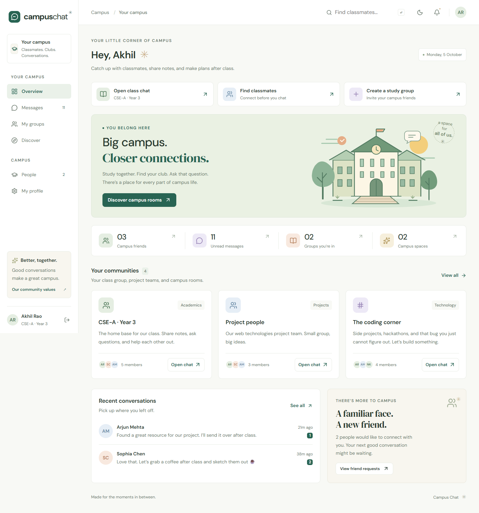
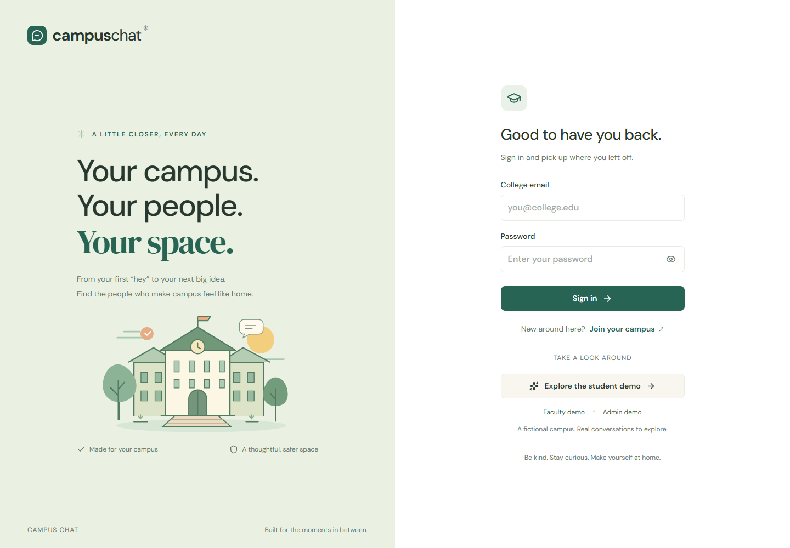
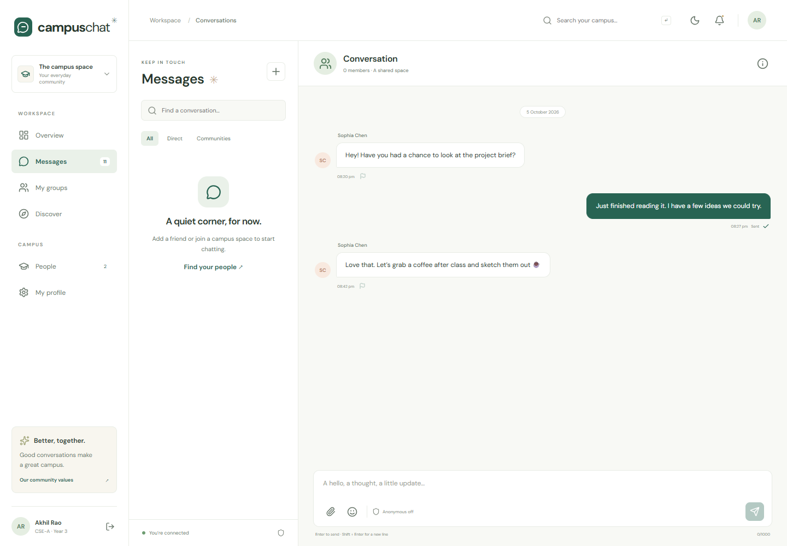

# Campus Chat ✳

**Your campus. Your people. Your space.**

A complete MERN rebuild of the original PHP/XAMPP Campus Chat project. Class groups, campus communities, and friends-only messaging come together in a responsive React workspace with a warm green palette, custom campus illustrations, and light and dark themes.



## Run the demo

Install **Node.js 24 LTS** (minimum 22.12), then run from the repository root:

```sh
npm ci
npm run demo
```

Open **http://localhost:5173** and choose the student, faculty, or admin demo. No XAMPP or separately installed MongoDB is needed. The demo runs a real local MongoDB server, with fictional records persisted in the ignored `.runtime/mongodb` folder. On Windows, the first install/run downloads a large MongoDB binary and can take several minutes. Normal development below can use Docker, an existing MongoDB installation, or Atlas instead.

| Account       | Email                        | Default demo password |
| ------------- | ---------------------------- | --------------------- |
| Student       | `akhil@college.edu`          | `CampusDemo!2026`     |
| Faculty       | `evelyn@faculty.college.edu` | `CampusDemo!2026`     |
| Administrator | `admin@college.edu`          | `CampusDemo!2026`     |

Other fictional students include `sophia@college.edu`, `arjun@college.edu`, and `priya@college.edu`, using the same demo password. Set `DEMO_PASSWORD` to choose a different password when first seeding an empty database. Seeding skips a database that already contains users. Demo sign-in and seeding are disabled in production.

## What you can do

- Register with a college email, roll number, section, and year. Students automatically join their class group.
- Find people, send or respond to friend requests, and start private conversations with accepted friends.
- Create private interest/general groups, invite friends, and join or leave campus rooms. Faculty can create section groups.
- Send persistent live messages, images, PDF/Word documents, ZIPs, and text files. Browse earlier history, use emoji, and see typing and read receipts.
- Switch anonymous messaging on. Other members cannot see the sender’s identity; assigned faculty can review it when a message is reported.
- Update your name, bio, avatar, profile color, privacy preference, and password.
- Report messages to a selected faculty member. Faculty review their assigned reports; admins can review all reports.
- Manage campus sections, activation, community statistics, and administrative audit history.

Images can be up to 5 MB for avatars and 10 MB for messages. Message text supports up to 1,000 characters. Attachments and conversation history require membership.

## Develop with your own MongoDB

Copy `.env.example` to `.env` and set `MONGODB_URI`. For local Docker MongoDB:

```sh
docker compose up -d
```

For a fictional development campus:

```sh
npm run seed
npm run dev
```

The React client runs at `http://localhost:5173`; Express runs at `http://localhost:4000`. Vite proxies the API and Socket.IO so session cookies stay on the same origin. Atlas connection strings also work.

For a fresh campus without demo records, set `ADMIN_EMAIL` and a strong `ADMIN_PASSWORD` (at least 12 characters) in your local `.env`, then run:

```sh
npm run admin:create
```

Sign in as the administrator and create sections before students register. This command creates a new admin and never changes an existing account’s role. Optional `ADMIN_FIRST_NAME` and `ADMIN_LAST_NAME` customize the name. Keep `.env` private.

Allowed email domains come from `ALLOWED_EMAIL_DOMAINS`. Lecturer registration additionally requires a configured domain beginning with `faculty.`. The original PHP app did not deliver verification email; this app validates college domains without claiming email verification.

## Build and verify

```sh
npm run build          # React production bundle
npm test               # 14 integration tests against real MongoDB
npx playwright install chromium
npm run test:e2e       # Browser flows, including two users and mobile navigation
npm run format:check
```

`npm run check` runs the build and backend tests. The browser test runner starts a demo server automatically if one is not already running. To use installed Chrome, set `PLAYWRIGHT_CHANNEL=chrome` in your shell. To enable GitHub Actions, copy [the CI template](docs/ci-workflow.yml) to `.github/workflows/ci.yml` using a GitHub login with `workflow` permission. It runs formatting, build, backend tests, and browser tests.

## Production

Set `NODE_ENV=production`, `MONGODB_URI`, and `CLIENT_ORIGIN` to your HTTPS app origin. Run `npm run build`, then `npm start`. Express serves the built React app, REST API, and Socket.IO together. Use a TLS reverse proxy with WebSocket support and persistent storage for `server/uploads`. Set `TRUST_PROXY` to the exact number of trusted proxy hops only when deploying behind that proxy.

The provided `Dockerfile` builds the client and runs the production API as a non-root user. Build with `docker build -t campus-chat .` and provide the environment above when running the container. `compose.yaml` is the local MongoDB service, not a production hosting configuration.

## Project layout

```text
client/           React pages, components, theme, and Vite configuration
server/src/       Express routes, Mongoose models, sessions, uploads, Socket.IO
server/test/      API, privacy, authorization, and live-delivery integration tests
tests/e2e/        Playwright browser flows
scripts/          Local MongoDB demo launcher
docs/             Architecture, migration map, and UI screenshots
legacy/php/       Original PHP source, preserved as a migration reference
coursework/       Original GitHub web technology exercises
```

The current runtime uses MongoDB, Express, React, and Node. PHP and MySQL are not required. Original GitHub history remains intact; migration commit timestamps use the repository owner’s requested November–December 2025 dates. See [the migration notes](docs/MIGRATION.md) for feature mapping and timestamp context, and [architecture](docs/ARCHITECTURE.md) for implementation details.

<details>
<summary>More UI previews</summary>




</details>
