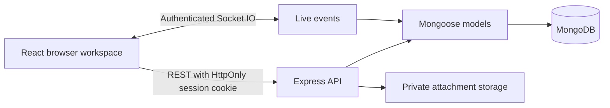

# Architecture

## Data and access

Users have student, lecturer, or admin roles. Sessions store only SHA-256 hashes of random cookie tokens and expire after seven days. Passwords use bcrypt. Logout revokes the session, and changing a password revokes other sessions. Production cookies are secure, HttpOnly, and SameSite=Lax; mutation requests check their origin.

Friendships have one unique key for each user pair and move between pending, accepted, and rejected. Direct conversations require accepted friendship. Private groups accept only invited members; section groups require the student’s matching section and year, with faculty/admin access. Room discovery exposes community descriptions and membership, while message previews are available only to joined members. All history, sending, typing, and attachment routes check membership.

Conversations share one model for direct, group, and room chats. Unique keys prevent duplicate direct or automatic section conversations. Membership updates and read cursors use atomic MongoDB operations. Messages are paginated by creation time and document ID. Read cursors are stored per user in the conversation; message responses calculate receipt counts without publishing a reader identity list.

Anonymous messages are serialized separately for each recipient. Peer responses omit the sender’s ID, name, email, and avatar. The author can identify their own messages. Socket.IO uses this same serialization rather than broadcasting raw MongoDB documents. Reports retain the message reference so assigned faculty and admins can identify the actual author during review.

Uploads are limited in memory, identified by their file signatures, assigned random filenames, and saved outside the public React bundle. Downloads require a valid session and conversation membership. Disguised executable uploads are rejected. React renders message content as text. The API includes rate limiting, request-size limits, Helmet headers, and controlled error responses.

## API groups

| Routes                          | Purpose                                                                      |
| ------------------------------- | ---------------------------------------------------------------------------- |
| `/api/auth/*`                   | Registration, login, logout, current user, registration sections, local demo |
| `/api/users*`                   | Campus directory, profile, avatar, password                                  |
| `/api/friends*`                 | Friendship requests and decisions                                            |
| `/api/conversations*`           | Direct/group/room creation, membership, messages, read cursors               |
| `/api/discover`                 | Available campus rooms and eligible groups                                   |
| `/api/messages/:id/attachment`  | Authorized attachment download                                               |
| `/api/faculty`, `/api/reports*` | Report assignment and moderation                                             |
| `/api/admin*`                   | Admin statistics, sections, audit history                                    |
| `/api/health`                   | Database-aware health check                                                  |

Socket events are `message:new`, `typing`, `presence`, `conversation:read`, and `data:refresh`. Sockets authenticate against the same server-side session as REST, and active sockets recheck session validity. Reconnection refreshes conversation data and recent message history. The UI merges in-flight history with newly received messages to preserve live delivery.

## Operations

`npm run demo` starts a real MongoDB binary with local persisted fictional data. `npm test` uses a fresh isolated MongoDB database and temporary uploads. Normal development and production connect to the configured MongoDB URI. A first-run administrator can be created with `npm run admin:create`, after which sections can be added in the UI.

Production uses a single origin behind HTTPS. Keep the upload directory and MongoDB data persistent, back them up together, and configure the trusted proxy hop count for your infrastructure. The app is intended for a single API instance; horizontally scaled deployments would also need a shared Socket.IO adapter, shared upload storage, and distributed presence/rate limiting.
